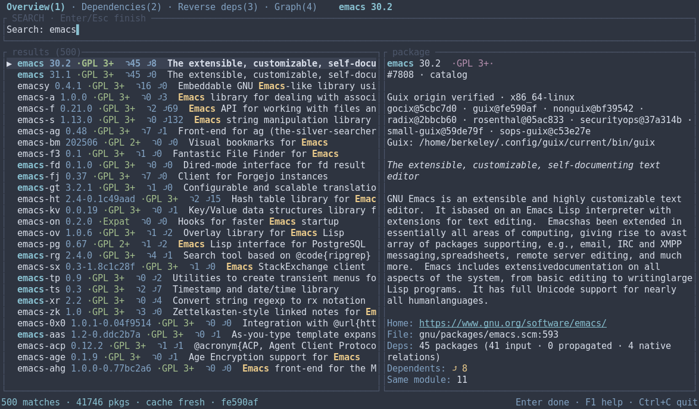
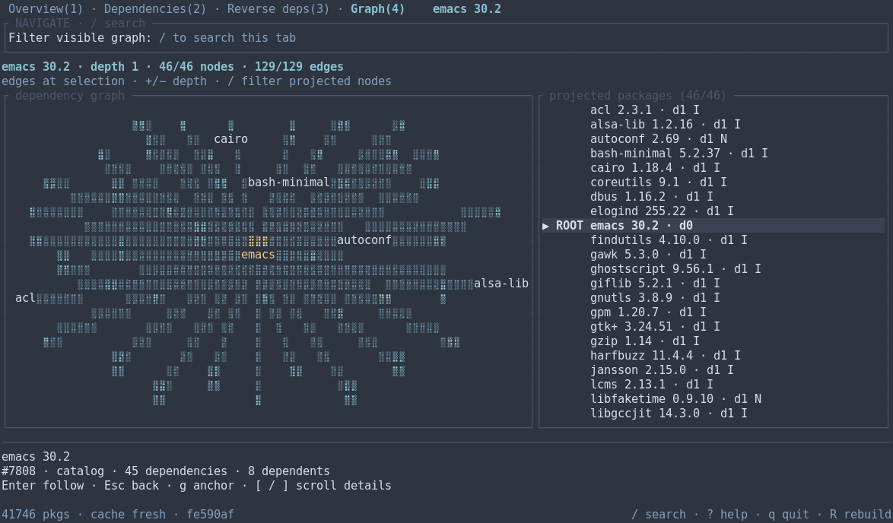
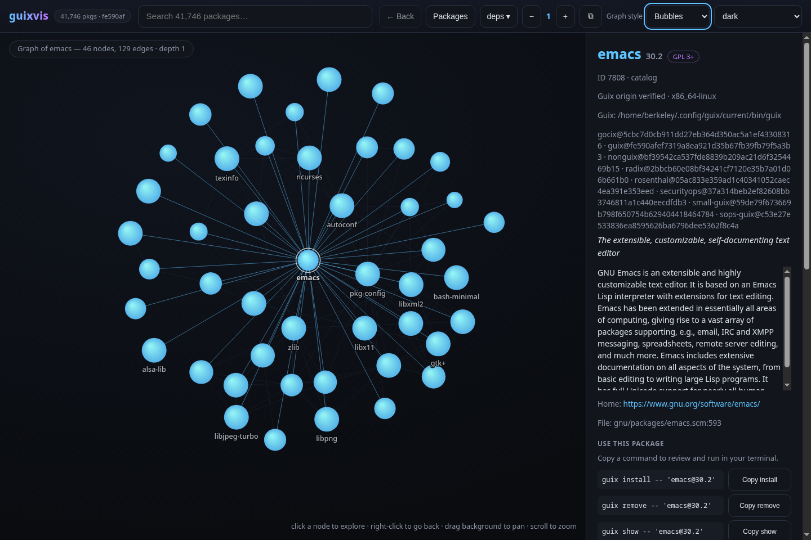
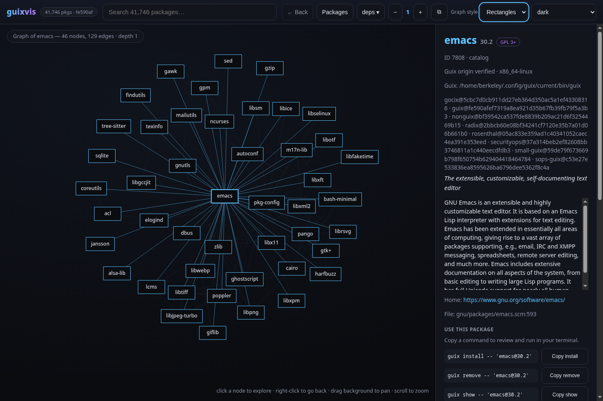
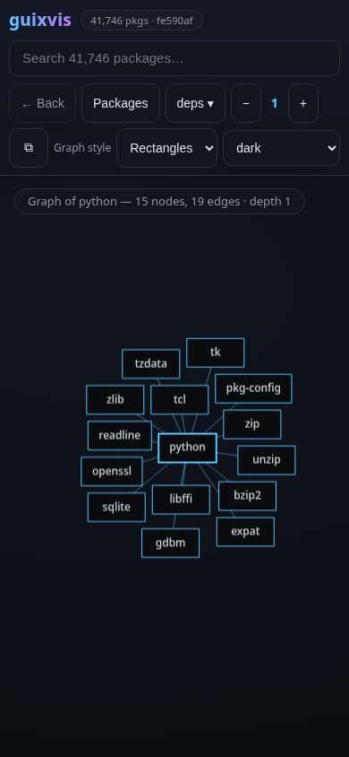

# guixvis

Interactive package explorer and dependency visualizer for **GNU Guix** — a
terminal UI (Rust + ratatui) in the spirit of Arch's pacvis: search **any**
package, see everything **related** to it, with fast fuzzy search and a
polished, keyboard-first interface.

[Português brasileiro](README.pt-BR.md) · [User guide](docs/usage.md) ·
[Changes in 0.8.0](docs/releases/0.8.0.md) · [Security](SECURITY.md)

Version 0.8.0 keeps the same package selected across tabs, searches the full
dependency and reverse-dependency closures, and starts the terminal graph at
one hop. Different versions and private Guix package variants stay distinct
throughout the terminal, browser, and Emacs client.

## A note from the author

I built this for my own use. I run Guix on my machines, I kept forgetting how
packages hang together, and I wanted something quicker than grepping `guix show`
all afternoon — so guixvis is keyboard-first, dark by default, and its graph is
meant to be read in a terminal.

It is the tool I reach for every day. Feel free to use it too, and to change
whatever does not suit you.

## Features

- **Search anything** — fuzzy search across all packages (name + synopsis):
  several words are AND-ed, names beat synopsis matches, exact substrings beat
  scattered ones, and every row shows its dependency counts and license so the
  list answers questions instead of just ranking names.
- **Package details** — version, description, licenses, homepage, and the
  source location (`gnu/packages/emacs.scm:591`).
- **Dependencies and reverse dependencies** — expandable trees plus local
  name/version filters over all reachable package objects. Ordinary (`I`),
  propagated (`P`), and native (`N`) inputs are included.
- **Dependency graph** — a one-hop terminal view with focused edges, a
  selectable package list, and complete selected-package details. Follow nodes
  with Enter or increase depth as needed.
- **Cached startup** — a binary snapshot avoids repeating extraction. Its
  origin records the selected Guix launcher, system, and all channel commits;
  an empty global search browses high-fan-in packages.

- **Zero configuration** — works on any GNU Guix system; first run builds the
  index in the background with live progress.
- **Package commands** — preview and copy `guix install`, `guix remove`,
  `guix show`, and `guix shell` commands from the browser or Emacs. You choose
  when to run them; browsing never changes your profile.

## Screenshots

Captured from the locally installed 0.8.0 build, using the real Guix index.





## Web UI

`guixvis web` serves the same explorer as a local website on
<http://127.0.0.1:8787>: the fuzzy search box on top, the package detail
panel with clickable related-package chips, and the interactive graph where
every bubble is a package — click one to open its view. Deep links
include a package ID and snapshot token, so same-name variants do not get
mixed up. Old name-only links still work; exact links from a replaced snapshot
ask you to search again. Links refer to a local service, not a public catalog. Right-click the canvas or use its visible **Back** button to
return one Guixvis graph step, restoring its package, depth, and direction.
At the first in-app view, Back is disabled and cannot leave the site. The
layout works on phone sizes. Result rows carry
the license chip and the dependency/dependent counts, and a name that only
matched through its synopsis renders dimmed — so "why is this here?" answers
itself.

Use **Packages** in the toolbar to keep the search results on screen. Each row
shows the version, synopsis, license, and dependency counts. The list displays
up to 100 ranked results; narrow the query when it reaches that limit. Switch
back to **Graph** whenever you want to follow the connections.

Choose **Bubbles** or **Rectangles** under Graph style. The choice persists in
this browser. Bubbles keep readable labels for the root, selection, and hubs
that fit; rectangles put a name inside each shape, shortening long names.
Hover a node or select it with the keyboard to inspect it. Drag with the
primary mouse button to move a node, drag the background to pan, scroll to
zoom, or pinch to zoom on touch screens. These gestures do not follow a package.







## Themes

Both interfaces ship with nine selectable color themes: **dark** (TUI default),
**one**, **light**, **dracula**, **nord**, **gruvbox-dark**, **tokyo-night**,
**catppuccin-mocha** and **tron** — the last one is pure black with neon
bubbles, which is what you want on an OLED panel at night.

- TUI: in Navigate mode, press `T` to cycle (the active theme is shown in the status bar);
  the choice is saved to `$XDG_CONFIG_HOME/guixvis/theme` (normally
  `~/.config/guixvis/theme`). Use `guixvis --theme nord` for a one-run override.
  `NO_COLOR` is honored with a grayscale fallback.
- Web UI: pick a theme in the topbar selector; the choice is remembered
  between sessions. **System** follows your operating system's light/dark
  preference and is the default for new users. Reduced-motion preferences
  are respected, and settled graphs stop requesting animation frames.

## Requirements

- GNU Guix (`guix` on `PATH`, or set `GUIX` to your Guix profile).
- Rust 1.88+ (edition 2021) to build from source.

## Install

### From source (cargo)

```sh
git clone https://codeberg.org/berkeley/guixvis guixvis
cd guixvis
cargo install --locked --features web --path .  # installs to ~/.cargo/bin
# or, to put it on your PATH directly:
cargo install --locked --features web --root ~/.local --path .
guixvis
```

Omit `--features web` if you only want the terminal interface. The browser and
native Emacs client need the web feature.

Mirrors: `github.com/cristiancmoises/guixvis`,
`git.securityops.co/cristiancmoises/guixvis`,
`git.securityops.com.br/cristiancmoises/guixvis`.

### From the securityops Guix channel

guixvis is packaged in the
[securityops channel](https://git.securityops.com.br/cristiancmoises/securityops-channel)
(`(securityops packages apps)`). Add the channel to `channels.scm` (see the
channel README), `guix pull`, then:

```sh
guix install guixvis
```

The channel builds guixvis from source with a vendored Cargo registry
(offline, `cargo --frozen`), including the web UI (`guixvis web`).

### Release artifacts (.zupt)

Source releases are available as `guixvis-<version>.zupt`, a
[zupt](https://git.securityops.com.br/cristiancmoises/zupt) archive written with
the maximum compression level and **no password**, so anyone can open it.
Once published, download the archive and `SHA256SUMS` from the
[0.8.0 release](https://codeberg.org/berkeley/guixvis/releases/tag/v0.8.0), then:

```sh
sha256sum -c SHA256SUMS
zupt test    guixvis-0.8.0.zupt    # verify archive integrity
zupt list    guixvis-0.8.0.zupt    # inspect paths before extracting
zupt extract guixvis-0.8.0.zupt    # creates ./guixvis-0.8.0/
```

Then build it the normal way:

```sh
cd guixvis-0.8.0
cargo build --locked --release --features web
```

`zupt` comes from the securityops channel (`guix install zupt`) or from its own
repositories. Releases up to 0.3.0 were re-packed from `.tar.gz` into `.zupt`,
so every version now ships in the same format; the Guix channel keeps a plain
`.tar.gz` for its package source, because the build daemon has to unpack it
without extra tools. Those internal package inputs are separate from release
downloads: new uploaded release archives use `.zupt` only. Forge-generated
source links may still offer other formats. See [Releasing](docs/releasing.md)
for the packaging and verification checklist.

### Emacs

Load `elisp/guixvis.el` to get the terminal launcher and a native package
browser. Start `guixvis web` in a terminal, then use `M-x guixvis-search` for
an asynchronous results table or `M-x guixvis-package` to look up a name.
Press `RET` for details, `g` to refresh, `s` to search, `w` to copy a Guix
command, and `b` to open the browser. No package commands run automatically.

```elisp
(add-to-list 'load-path "/path/to/guixvis/elisp")
(require 'guixvis)
;; Optional, if you use Emacs-Guix:
;; (guixvis-popup-install)
```

`M-x guixvis` runs the TUI in a reusable `term` buffer; `M-x guixvis-web`
opens the local website. Set `guixvis-web-url` if you use a different local
port. See the [Emacs guide](docs/usage.md#emacs) for the available settings.

The file ships here rather than in emacs-guix so the menu entries only show
up for people who actually have the program installed (see
[guix/emacs-guix#40](https://codeberg.org/guix/emacs-guix/pulls/40)).

## Usage

```
guixvis              start the explorer (builds the index on first run)
guixvis --rebuild    force an index rebuild
guixvis --theme nord  choose a terminal palette for this run
guixvis web          start the local browser/Emacs API
guixvis --help       all options
```

### Keymap

The header tells you whether you are in **Search** or **Navigate** mode.
Overview starts in Search. Press `/` to search from any tab; every printable
character is input there, including command letters and digits. `Enter` or
`Esc` finishes editing without following a row or clearing your query.

| Key | Action |
|---|---|
| `Tab` / `Shift+Tab` | change tabs in either mode |
| arrows, `PgUp` / `PgDn` | move the current list's cursor |
| `Ctrl+U` | clear the current tab's query |
| `F1` / `Ctrl+C` | help / quit in either mode |
| `/` | enter Search from Navigate |
| `1`–`4`, `d` / `r` / `v` | choose a tab in Navigate |
| `Enter` | expand a tree row or follow a graph node in Navigate |
| `Esc` | in Navigate: clear the local filter first, then return through graph history |
| `+` / `−` | graph depth, 1–8, in Navigate |
| `e` / `l` | graph edge mode / canvas labels in Navigate |
| `[` / `]` | scroll the selected graph package's details |
| `g` | refocus the graph on the Overview package |
| `T` / `R` / `o` | theme / rebuild / homepage in Navigate |
| `?` / `q` | help / quit in Navigate |

### Tabs

1. **Overview** searches the catalog with fuzzy name/synopsis matching.
2. **Dependencies** searches every reachable dependency of the selected
   package, including private variants and all three input categories.
3. **Reverse deps** searches the full reverse closure in this index.
4. **Graph** filters the currently projected nodes; it is not a whole-closure
   search. Use the dependency tabs for that.

Local filters use case-insensitive literal words against name and version;
every word must match. They do not use Overview's fuzzy ranking. Each tab keeps
its own query and cursor. Moving down a dependency list does not change the
Overview package. Choosing a different Overview result resets its related views.

The tree distinguishes repeated paths and cycles. Filtering searches the full
closure even when rows are collapsed or the normal expanded-row view is capped.
Direct dependencies are never hidden by that expanded-row cap.

## How it works

On startup Guixvis loads its snapshot or runs the embedded Guile indexer.
It starts with `fold-packages`, then follows the actual package objects in
`inputs`, `propagated-inputs`, and `native-inputs`. Same-name objects are
not merged. Private variants reached through inputs remain visible.

These are declared package inputs for the selected Guix system, not a store
closure, derivation graph, cross-compilation plan, or list of installed packages.
Extraction failures produce diagnostics and an incomplete-index warning rather
than silently pretending every edge was resolved.

The binary cache lives at `~/.cache/guixvis/index-v5.bin` (or under
`$XDG_CACHE_HOME`). It is written atomically. Version 0.8 rebuilds once and leaves
the older v4 cache untouched. Corrupt snapshots are quarantined, not deleted.

Guix selection follows `GUIX` (profile or executable), then `PATH`, then the
standard profile locations. Launcher symlinks are preserved: resolving them
can lose Guix channel extensions. Cache origin includes that invocation path,
the system, and sorted channel names/commits. If origin cannot be verified,
or `GUIX_PACKAGE_PATH` supplies mutable local modules, the UI says so.
Package IDs are meaningful only together with their snapshot token.

## Reading the graph

The terminal starts at depth **1**, with edges focused on the selected
package. This keeps the first view readable without pressing `−` repeatedly.
Fine Unicode dots keep the canvas edges light. Wide terminals show a canvas
beside a navigable package list; narrow ones use
the list alone. Complete selected names and versions wrap in the details area.
Use `[` and `]` if those details need scrolling.

`Enter` follows the selected package. `Esc` first leaves Search, then clears
a filter, then returns through graph history. `g` restores the Overview anchor.
Depth, selection, and local query survive tab changes.

`e` cycles focused, all, and no edges; `l` toggles canvas labels. The list
remains available even when labels cannot fit. Its `I/P/N` badges retain all
input categories encountered during discovery.

Graphs are intentionally bounded: 200 nodes **including the root**, 3,000
edges, and a traversal-work limit. Counts distinguish displayed, omitted, and
unknown totals. An unknown total is not shown as zero. For a complete relation
search, use Dependencies or Reverse deps. The web graph still defaults to
depth 2.

## Performance

Run `cargo run --release --example bench` to measure cache loading, search,
and graph layout on your machine. `node examples/bench-web.cjs` measures the
browser's graph layout code separately.

On this machine, a release build over 41,746 objects from eight channels
measured 8.73 s for extraction and 109 ms to decode the 18.6 MB snapshot.
Eight search queries averaged 2.63 ms (best of 20 runs per query, 500-hit cap).
The sampled 200-node layouts took about 13–15 ms for 300 iterations.

These are local measurements, not latency guarantees or a like-for-like
speedup claim against older indexes. Version 0.8 retains more objects and exact
identities. Relation traversal and terminal graph layout run outside drawing,
so changing a filter does not recompute a layout in the render loop.

## Security

guixvis runs on your machine and reads your Guix installation, so the web UI is
deliberately boring about reachability:

- binds `127.0.0.1` only, and refuses sockets whose peer is not loopback;
- rejects requests whose `Host` is not `localhost`/`127.0.0.1`/`::1`
  (DNS-rebinding guard) and whose `Origin` or `Sec-Fetch-Site` marks them as
  cross-site;
- serves a strict CSP (`default-src 'self'` — on every route, not just the
  document), `X-Content-Type-Options`,
  `X-Frame-Options: DENY`, `Referrer-Policy: no-referrer`,
  `Cross-Origin-Resource-Policy` and `Cache-Control: no-store` on the API;
- validates package names from the URL, caps search queries at 200 characters,
  depth at 1–8 and graphs at 200 nodes including the root, with a bounded
  concurrency of four;
- writes the embedded Guile script into a private `0700` directory as a `0600`
  file (the system temp directory is world-writable), and refuses absurdly large
  cache files before reading them;
- caps request bodies at 8 KB: a read-only GET API has no business receiving
  one.

The API has no login and is intended for local use. Package commands are shown
as text and copied only when requested; the server never installs or removes
packages. Do not expose it through a public proxy. See [SECURITY.md](SECURITY.md)
for the trust boundaries and remaining limitations.

## Development

```sh
cargo fmt --check
cargo clippy --locked --all-targets --all-features -- -D warnings
cargo test --locked --all-features            # unit + fixture + web tests
node --test tests/web_graph_tests.cjs tests/web_app_tests.cjs  # browser graph and app logic
emacs -Q --batch -L elisp -l elisp/guixvis.el -l elisp/guixvis-tests.el -f ert-run-tests-batch-and-exit
cargo test --test live_guix_tests -- --ignored   # live tests against real Guix
cargo test --release --test live_guix_tests real_index_search_latency -- --ignored
```

Layout: `src/index.rs` (in-memory index + BFS), `src/search.rs` (nucleo
fuzzy search worker), `src/indexer.rs` (`guix repl` subprocess), `src/cache.rs`
(binary snapshot), `src/graph.rs` (graph extraction + layout), `src/app.rs`
(state + keys), `src/ui/*` (rendering), `data/guix-index.scm` (Guile indexer).

## Troubleshooting

- **"guix not found"** — export `GUIX=/path/to/your-guix-profile` or install
  Guix; guixvis also checks the standard system profile paths.
- **Slow first run** — the first index build compiles Guile package modules;
  it finishes in seconds on warm caches and a few minutes cold. Progress is
  shown live; the UI stays usable afterwards.
- **Stale data after `guix pull`** — restart guixvis; the cache is rebuilt
  automatically when its verified origin changes.
- **No colors** — `NO_COLOR` is honored (grayscale theme).
- **Kill a stuck indexer** — leave Search and press `R`, or restart with
  `guixvis --rebuild`. Inspect the reported error before removing any cache.

## License

GPL-3.0-or-later. See [LICENSE](LICENSE).
