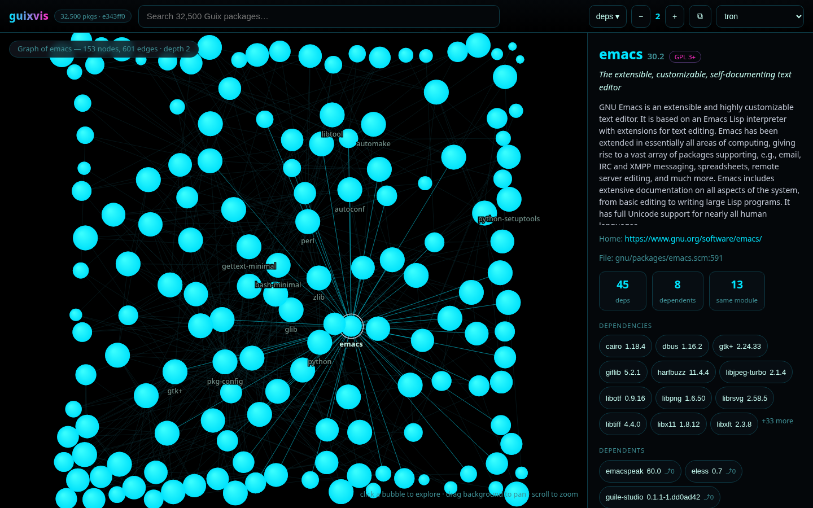
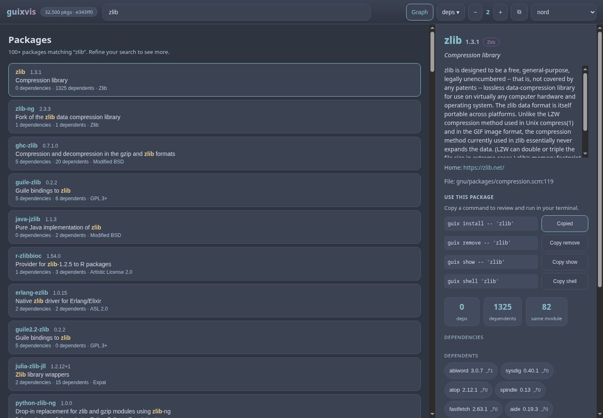

# guixvis

Interactive package explorer and dependency visualizer for **GNU Guix** — a
terminal UI (Rust + ratatui) in the spirit of Arch's pacvis: search **any**
package, see everything **related** to it, with fast fuzzy search and a
polished, keyboard-first interface.

[Português brasileiro](README.pt-BR.md) · [User guide](docs/usage.md) ·
[Changes in 0.6.0](docs/releases/0.6.0.md) · [Security](SECURITY.md)

Version 0.6.0 adds a package list in the browser, copyable Guix commands,
native Emacs search and details, and remembered terminal themes. It also fixes
search edge cases, stale responses, and unsafe cache temporary-file handling.

```
┌─ Search: emac▌────────────────────────────────────────────────┐
│  [Overview(1)] [Dependencies(2)] [Reverse deps(3)] [Graph(4)] │
│ ┌───────────────────────────┐ ┌──────────────────────────────┐│
│ │ ▶ emacs  30.2  GPL 3+     │ │ GNU Emacs is an extensible…   ││
│ │   emacs-minimal  30.2     │ │                              ││
│ │   emacs-next  31.0        │ │ Home: gnu.org/software/emacs  ││
│ │   (fuzzy match highlights)│ │ File: gnu/packages/emacs.scm:591│
│ └───────────────────────────┘ └──────────────────────────────┘│
│ 157 matches · 32500 pkgs · cache fresh (e343ff0) · ? help      │
└───────────────────────────────────────────────────────────────┘
```

## A note from the author

I built this for my own use. I run Guix on my machines, I kept forgetting how
packages hang together, and I wanted something quicker than grepping `guix show`
all afternoon — so guixvis is keyboard-first, dark by default, and its graph is
meant to be read in a terminal.

It is the tool I reach for every day. Feel free to use it too, and to change
whatever does not suit you.

## Features

- **Search anything** — fuzzy search across all packages (name + synopsis):
  several words are AND-ed, names beat synopsis matches, exact substrings beat
  scattered ones, and every row shows its dependency counts and license so the
  list answers questions instead of just ranking names.
- **Package details** — version, description, licenses, homepage, and the
  source location (`gnu/packages/emacs.scm:591`).
- **Dependencies** — expandable tree of inputs (`P` propagated, `N` native),
  with dependent counts per node (`⤴ 12`).
- **Reverse dependencies** — "who depends on this package": direct list plus
  a depth-limited transitive section.
- **Dependency graph** — force-directed layout (hand-rolled Fruchterman–
  Reingold, deterministic), follow nodes with Enter, depth control with `+/−`.
- **Instant startup on later runs** — the index is cached as a binary
  snapshot and automatically rebuilt when your Guix channel commit changes;
  the empty search box browses the highest-fan-in hubs instead of the
  alphabet.
- **Zero configuration** — works on any GNU Guix system; first run builds the
  index in the background with live progress.
- **Package commands** — preview and copy `guix install`, `guix remove`,
  `guix show`, and `guix shell` commands from the browser or Emacs. You choose
  when to run them; browsing never changes your profile.

## Demo video

[](assets/guixvis-demo.mp4)

## Screenshots

Search and package details:


Dependency tree (expand/collapse with Enter):


Reverse dependencies (who depends on this package):


## Web UI

`guixvis web` serves the same explorer as a local website on
<http://127.0.0.1:8787>: the fuzzy search box on top, the package detail
panel with clickable related-package chips, and the interactive graph where
every bubble is a package — click one to open its view. Deep links
(`#/p/emacs?depth=2&dir=reverse`) are shareable and work with the browser
back button; the layout is responsive down to phone sizes. Result rows carry
the license chip and the dependency/dependent counts, and a name that only
matched through its synopsis renders dimmed — so "why is this here?" answers
itself.

Use **Packages** in the toolbar to keep the search results on screen. Each row
shows the version, synopsis, license, and dependency counts. The list displays
up to 100 ranked results; narrow the query when it reaches that limit. Switch
back to **Graph** whenever you want to follow the connections.

Names above the bubbles are placed with measured boxes and a background halo:
labels that would collide are simply not drawn (the hover tooltip still names
every bubble), so the graph stays legible instead of turning into a pile of
overlapping text.



▶ [Watch the web UI demo](assets/guixvis-web-demo.mp4)


## Themes

Both interfaces ship with nine selectable color themes: **dark** (TUI default),
**one**, **light**, **dracula**, **nord**, **gruvbox-dark**, **tokyo-night**,
**catppuccin-mocha** and **tron** — the last one is pure black with neon
bubbles, which is what you want on an OLED panel at night.

- TUI: press `T` to cycle (the active theme is shown in the status bar);
  the choice is saved to `$XDG_CONFIG_HOME/guixvis/theme` (normally
  `~/.config/guixvis/theme`). Use `guixvis --theme nord` for a one-run override.
  `NO_COLOR` is honored with a grayscale fallback.
- Web UI: pick a theme in the topbar selector; the choice is remembered
  between sessions. **System** follows your operating system's light/dark
  preference and is the default for new users. Reduced-motion preferences
  are respected, and settled graphs stop requesting animation frames.

The TUI in the dracula theme:


The package list and command previews in 0.6.0, using the nord theme:



The graph in the nord theme:


## Requirements

- GNU Guix (`guix` on `PATH`, or set `GUIX` to your Guix profile).
- Rust 1.88+ (edition 2021) to build from source.

## Install

### From source (cargo)

```sh
git clone https://codeberg.org/berkeley/guixvis guixvis
cd guixvis
cargo install --locked --features web --path .  # installs to ~/.cargo/bin
# or, to put it on your PATH directly:
cargo install --locked --features web --root ~/.local --path .
guixvis
```

Omit `--features web` if you only want the terminal interface. The browser and
native Emacs client need the web feature.

Mirrors: `github.com/cristiancmoises/guixvis`,
`git.securityops.co/cristiancmoises/guixvis`,
`git.securityops.com.br/cristiancmoises/guixvis`.

### From the securityops Guix channel

guixvis is packaged in the
[securityops channel](https://git.securityops.com.br/cristiancmoises/securityops-channel)
(`(securityops packages apps)`). Add the channel to `channels.scm` (see the
channel README), `guix pull`, then:

```sh
guix install guixvis
```

The channel builds guixvis from source with a vendored Cargo registry
(offline, `cargo --frozen`), including the web UI (`guixvis web`).

### Release artifacts (.zupt)

Source releases are available as `guixvis-<version>.zupt`, a
[zupt](https://git.securityops.com.br/cristiancmoises/zupt) archive written with
the maximum compression level and **no password**, so anyone can open it. To
download the archive and `SHA256SUMS` from the
[0.6.0 release](https://codeberg.org/berkeley/guixvis/releases/tag/v0.6.0), then:

```sh
sha256sum -c SHA256SUMS
zupt test    guixvis-0.6.0.zupt    # verify archive integrity
zupt list    guixvis-0.6.0.zupt    # inspect paths before extracting
zupt extract guixvis-0.6.0.zupt    # creates ./guixvis-0.6.0/
```

Then build it the normal way:

```sh
cd guixvis-0.6.0
cargo build --locked --release --features web
```

`zupt` comes from the securityops channel (`guix install zupt`) or from its own
repositories. Releases up to 0.3.0 were re-packed from `.tar.gz` into `.zupt`,
so every version now ships in the same format; the Guix channel keeps a plain
`.tar.gz` for its package source, because the build daemon has to unpack it
without extra tools. Those internal package inputs are separate from release
downloads: new uploaded release archives use `.zupt` only. Forge-generated
source links may still offer other formats. See [Releasing](docs/releasing.md)
for the packaging and verification checklist.

### Emacs

Load `elisp/guixvis.el` to get the terminal launcher and a native package
browser. Start `guixvis web` in a terminal, then use `M-x guixvis-search` for
an asynchronous results table or `M-x guixvis-package` to look up a name.
Press `RET` for details, `g` to refresh, `s` to search, `w` to copy a Guix
command, and `b` to open the browser. No package commands run automatically.

```elisp
(add-to-list 'load-path "/path/to/guixvis/elisp")
(require 'guixvis)
;; Optional, if you use Emacs-Guix:
;; (guixvis-popup-install)
```

`M-x guixvis` runs the TUI in a reusable `term` buffer; `M-x guixvis-web`
opens the local website. Set `guixvis-web-url` if you use a different local
port. See the [Emacs guide](docs/usage.md#emacs) for the available settings.

The file ships here rather than in emacs-guix so the menu entries only show
up for people who actually have the program installed (see
[guix/emacs-guix#40](https://codeberg.org/guix/emacs-guix/pulls/40)).

## Usage

```
guixvis              start the explorer (builds the index on first run)
guixvis --rebuild    force an index rebuild
guixvis --theme nord  choose a terminal palette for this run
guixvis web          start the local browser/Emacs API
guixvis --help       all options
```

### Keymap

| Key | Action |
|---|---|
| type | fuzzy search (always live) |
| `Esc` | clear search / back out |
| `Tab` / `Shift+Tab` | cycle tabs |
| `1`–`4` | jump to tab (Overview, Dependencies, Reverse deps, Graph) |
| `↑` `↓` (or `j` `k` with empty search) | move selection |
| `PgUp` / `PgDn` | page |
| `Enter` | expand/collapse tree node · follow graph node |
| `d` / `r` / `v` (empty search) | open dependencies / reverse deps / graph |
| `h` / `l` or `←` / `→` | collapse / expand tree node |
| `+` / `−` | graph depth (1–8) |
| `g` / `G` (empty search) | top / bottom (graph: refocus root) |
| `o` (empty search) | open homepage in `$BROWSER`/`xdg-open` |
| `T` | cycle and save theme (9 palettes) |
| `R` | rebuild the index in the background |
| `?` | help |
| `q` (empty search) / `Ctrl+C` | quit |

Command letters (`d`, `r`, `v`, `j`, `k`, `g`, `G`, `q`, `o`, `+`, `−`, `1`–`4`)
act only while the search box is empty, so typing is never hijacked; use the
arrow keys to navigate while typing.

### Tabs

1. **Overview** — result list + detail pane.
2. **Dependencies** — expandable tree of what the package needs.
3. **Reverse deps** — direct dependents (expandable) + transitive section
   (depth 2+, press Enter on the section header to open it).
4. **Graph** — force-directed dependency graph; Enter follows a node,
   `+`/`−` adjusts depth, `g` refocuses the root on the selected package.

## How it works

On startup guixvis either loads its cache or spawns `guix repl` with an
embedded Guile script (`data/guix-index.scm`) that walks all packages via
`fold-packages`, extracts name/version/synopsis/description/licenses/location
and the dependency edges, and streams one JSON document to stdout (progress
lines on stderr). The Rust side validates the document, resolves the
dependencies, computes reverse dependency edges, and stores the index in
memory. A binary snapshot of that resolved index is then written under:

```
~/.cache/guixvis/index-v4.bin
```

The snapshot exists because parsing the indexer's JSON on every start cost more
than everything else in the program put together; see the benchmark numbers
below. It is written to a temp file and renamed into place, so a crash mid-write
cannot leave a half-written cache behind.

The cache is keyed on your Guix channel commit (from `guix describe`); when
Guix is updated the cache is rebuilt automatically. A corrupt cache is
quarantined (renamed, never silently deleted) and rebuilt.

Notes on the original design spec: the `egraph` crate name was evaluated for
the graph layout, but the crate published under that name is an unrelated
ML binary, so the layout is a hand-rolled deterministic Fruchterman–Reingold;
reverse edges are computed in Rust (not Guile) so they are unit-testable.

## Reading the graph

The graph used to be a field of identical dots — technically a graph, useless as
a picture — and then it was a readable picture that still looked like tangled
yarn. It is now calm as well: small dots, edges faded into the background, and
only the labels that earn their space.


- **Small bubbles.** Nodes are dots; hubs grow just enough to be findable, so
  two hundred of them stop looking like a smear.
- **Size** is fan-in plus fan-out.
- **Colour** follows BFS depth: bright for the root, plain for direct
  dependencies, progressively dimmer for deeper ones.
- **Hue** marks the kind of edge that pulled a package in: propagated inputs
  lean purple, native inputs lean amber, ordinary inputs stay blue.
- **Selection** gets a halo, its neighbours brighten, everything else fades
  back — handy in a dense cluster.
- **Labels** are drawn for the selection, the root and the biggest hubs that fit
  the terminal width.
- The header reports nodes, edges, hidden nodes and how long the layout took;
  the footer shows the selected package with its dependency counts.

- **Edge modes.** `e` cycles all edges (faded) → only the edges at the selection
  → no edges at all. `l` toggles hub labels. Whatever mode is active is spelled
  out in the footer, so nobody has to guess why the picture changed.

Keys: `Enter` follows the selected node, `+`/`−` change depth, `g` refocuses the
root, `e` cycles edge modes, `l` toggles labels, `1`–`4` (or `Tab`) switch tabs,
`T` cycles themes.

## Performance

Run `cargo run --release --example bench` to measure cache loading, search,
and graph layout on your machine. `node examples/bench-web.cjs` measures the
browser's graph layout code separately.

The table below records measurements from earlier releases on a 32,500-package
index. Your channel, machine, and cache state affect the result; these are not
latency guarantees. See the [0.6.0 notes](docs/releases/0.6.0.md) for this
release's changes and verification.

| Step | Time | Notes |
|---|---|---|
| Index build (`guix repl` + Guile) | **3.7 s** | only when the cache is missing or your channel moved |
| Cache load → usable index | **30 ms** | binary snapshot, 32,500 packages (was ~126 ms with gzipped JSON) |
| Fuzzy search, 500 hits | **~3 ms** | nucleo over name + synopsis; several terms are AND-ed and ranked as their geometric mean |
| Graph layout, 200 nodes | **≤10 ms** | deterministic Fruchterman–Reingold, 300 iterations |
| Graph API payload | **33 KB → 4.8 KB** | gzipped when the browser asks for it |

The indexer is fast enough that parallelising it would buy little; the cache
format is where the time was, so that is where it was spent. A uniform-grid
approximation of the layout was implemented, measured 25% slower than the exact
pairwise loop at the 200-node cap, and removed again — the comment in
`src/graph.rs` records the numbers so nobody re-adds it on a hunch. The snapshot lives
at `~/.cache/guixvis/index-v4.bin`, is written atomically, and is keyed on your
Guix commit.

## Security

guixvis runs on your machine and reads your Guix installation, so the web UI is
deliberately boring about reachability:

- binds `127.0.0.1` only, and refuses sockets whose peer is not loopback;
- rejects requests whose `Host` is not `localhost`/`127.0.0.1`/`::1`
  (DNS-rebinding guard) and whose `Origin` or `Sec-Fetch-Site` marks them as
  cross-site;
- serves a strict CSP (`default-src 'self'` — on every route, not just the
  document), `X-Content-Type-Options`,
  `X-Frame-Options: DENY`, `Referrer-Policy: no-referrer`,
  `Cross-Origin-Resource-Policy` and `Cache-Control: no-store` on the API;
- validates package names from the URL, caps search queries at 200 characters,
  depth at 1–8 and graphs at 200 related nodes plus the root, with a bounded
  concurrency of four;
- writes the embedded Guile script into a private `0700` directory as a `0600`
  file (the system temp directory is world-writable), and refuses absurdly large
  cache files before reading them;
- caps request bodies at 8 KB: a read-only GET API has no business receiving
  one.

The API has no login and is intended for local use. Package commands are shown
as text and copied only when requested; the server never installs or removes
packages. Do not expose it through a public proxy. See [SECURITY.md](SECURITY.md)
for the trust boundaries and remaining limitations.

## Development

```sh
cargo fmt --check
cargo clippy --locked --all-targets --all-features -- -D warnings
cargo test --locked --all-features            # unit + fixture + web tests
node --test tests/web_graph_tests.cjs         # browser graph logic
emacs -Q --batch -L elisp -l elisp/guixvis-tests.el -f ert-run-tests-batch-and-exit
cargo test --test live_guix_tests -- --ignored   # live tests against real Guix
cargo test --release --test live_guix_tests real_index_search_latency -- --ignored
```

Layout: `src/index.rs` (in-memory index + BFS), `src/search.rs` (nucleo
fuzzy search worker), `src/indexer.rs` (`guix repl` subprocess), `src/cache.rs`
(binary snapshot), `src/graph.rs` (graph extraction + layout), `src/app.rs`
(state + keys), `src/ui/*` (rendering), `data/guix-index.scm` (Guile indexer).

## Troubleshooting

- **"guix not found"** — export `GUIX=/path/to/your-guix-profile` or install
  Guix; guixvis also checks the standard system profile paths.
- **Slow first run** — the first index build compiles Guile package modules;
  it finishes in seconds on warm caches and a few minutes cold. Progress is
  shown live; the UI stays usable afterwards.
- **Stale data after `guix pull`** — restart guixvis; the cache is rebuilt
  automatically because the channel commit changed.
- **No colors** — `NO_COLOR` is honored (grayscale theme).
- **Kill a stuck indexer** — press `R` to start over, or delete
  `~/.cache/guixvis/` and restart.

## License

GPL-3.0-or-later. See [LICENSE](LICENSE).
