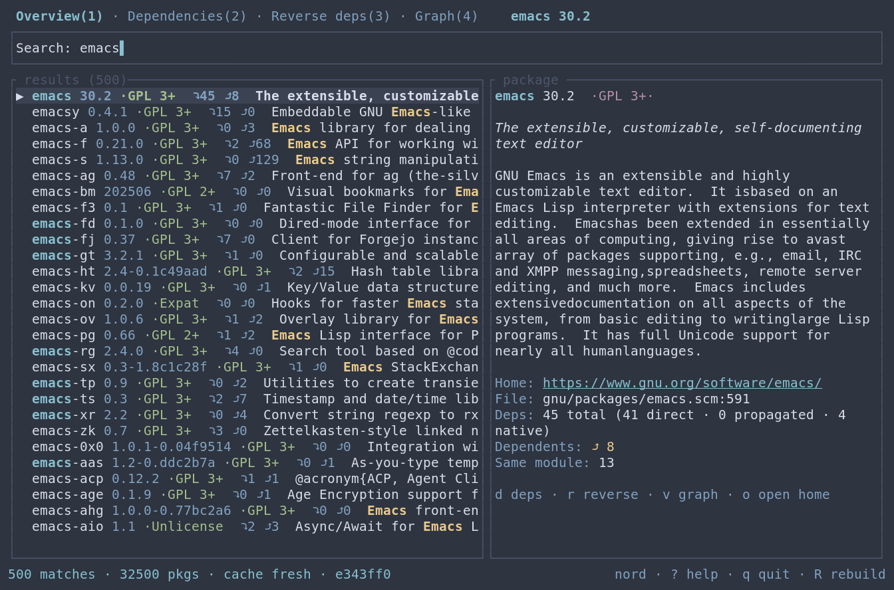
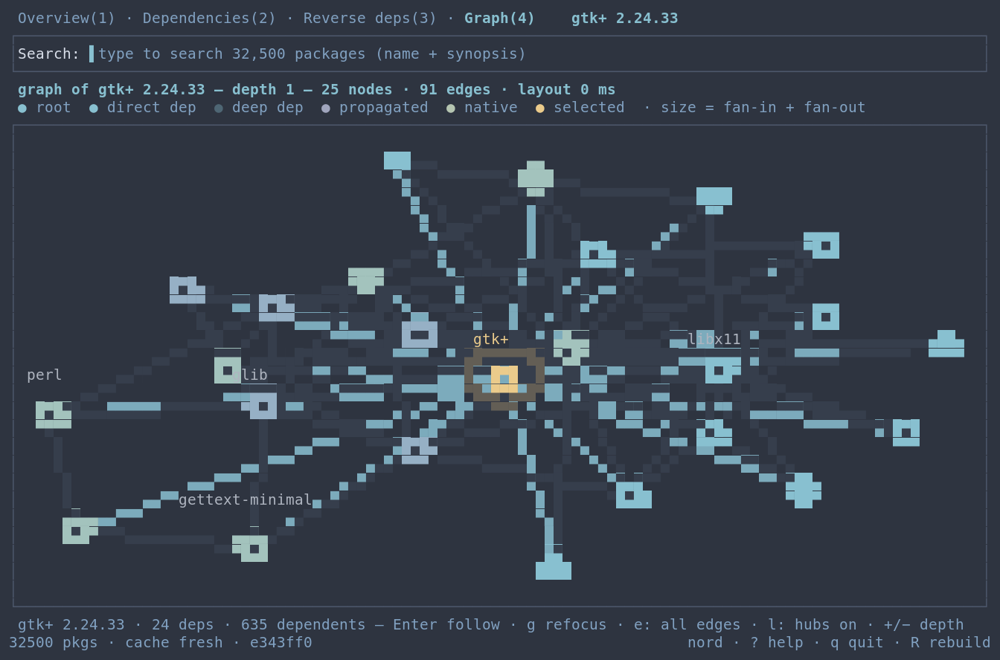
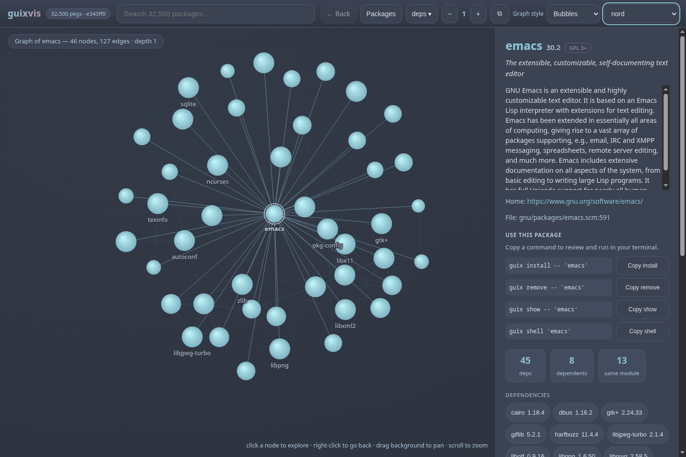
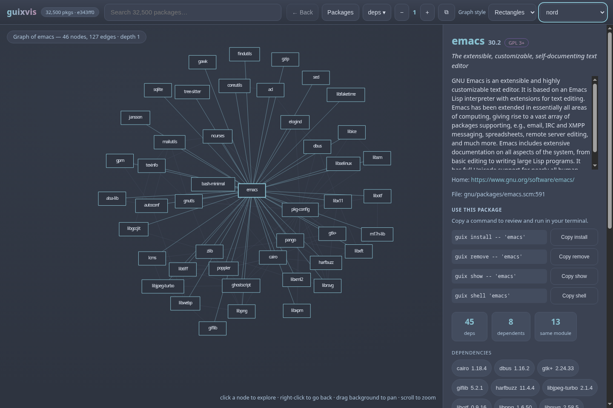
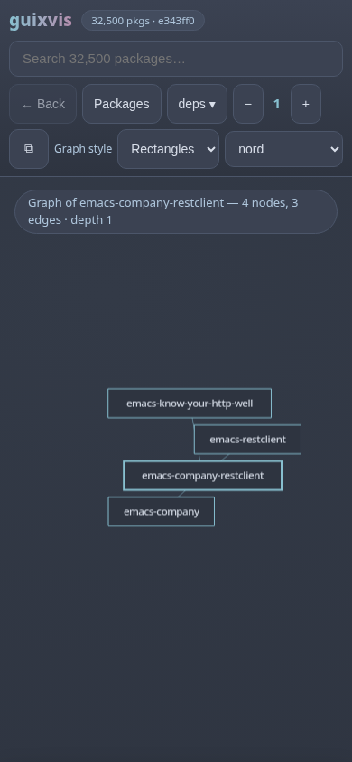

# guixvis

Explorador interativo de pacotes e visualizador de dependências para o
**GNU Guix** — uma interface de terminal (Rust + ratatui) no espírito do
pacvis do Arch: pesquise **qualquer** pacote, veja tudo que está
**relacionado** a ele, com busca fuzzy rápida e uma interface polida,
100% pelo teclado.

[English](README.md) · [Guia de uso](docs/usage.md) ·
[Mudanças na versão 0.7.0](docs/releases/0.7.0.md) · [Segurança](SECURITY.md)

A versão 0.7.0 mantém o pacote selecionado enquanto você percorre as árvores
no terminal, preserva a raiz e a profundidade do grafo seguido e acrescenta
uma navegação Voltar segura e dois estilos de grafo persistentes no navegador.

```
┌─ Busca: emac▌────────────────────────────────────────────────┐
│  [Visão geral(1)] [Dependências(2)] [Deps reversas(3)] [Grafo(4)] │
│ ┌───────────────────────────┐ ┌──────────────────────────────┐│
│ │ ▶ emacs  30.2  GPL 3+     │ │ GNU Emacs é um editor…        ││
│ │   emacs-minimal  30.2     │ │                              ││
│ │   emacs-next  31.0        │ │ Home: gnu.org/software/emacs  ││
│ │   (destaques do fuzzy)    │ │ Arq.: gnu/packages/emacs.scm:591│
│ └───────────────────────────┘ └──────────────────────────────┘│
│ 157 resultados · 32500 pacotes · cache atualizado (e343ff0)   │
└───────────────────────────────────────────────────────────────┘
```

## Uma nota do autor

Fiz isso para o meu próprio uso. Rodo Guix nas minhas máquinas, vivia esquecendo
como os pacotes se ligam, e queria algo mais rápido do que passar a tarde
grepeando `guix show` — por isso o guixvis é todo de teclado, escuro por padrão,
e o grafo foi feito para ser lido no terminal.

É a ferramenta que eu uso todo dia. Sinta-se à vontade para usar também, e para
mudar o que não te agradar.

## Recursos

- **Pesquise qualquer coisa** — busca fuzzy em todos os pacotes
  (nome + sinopse), com destaques, termos combinados e prioridade para
  correspondências no nome do pacote.
- **Detalhes do pacote** — versão, descrição, licenças, homepage e a
  localização do código-fonte (`gnu/packages/emacs.scm:591`).
- **Dependências** — árvore expansível de inputs (`P` propagado, `N` nativo),
  com contagem de dependentes em cada nó (`⤴ 12`).
- **Dependências reversas** — "quem depende deste pacote": lista direta e
  uma seção transitiva com limite de profundidade.
- **Grafo de dependências** — layout dirigido por forças (Fruchterman–
  Reingold determinístico); siga nós com Enter, mantenha a profundidade ao
  trocar de aba e pressione `g` para voltar ao pacote da Visão geral.
- **Inicialização instantânea depois da primeira vez** — o índice fica em
  cache binário e é reconstruído automaticamente quando o commit do seu
  canal Guix muda.
- **Zero configuração** — funciona em qualquer sistema GNU Guix; a primeira
  execução constrói o índice em segundo plano com progresso ao vivo.
- **Comandos do pacote** — veja e copie comandos de instalação, remoção,
  consulta e `guix shell` no navegador ou no Emacs. Você decide quando
  executá-los; navegar pelos pacotes não altera seu perfil.

## Capturas de tela

Busca e detalhes do pacote no terminal:



Grafo de dependências no terminal:



## Interface web

O `guixvis web` serve o mesmo explorador como um site local em
<http://127.0.0.1:8787>: busca fuzzy no topo, painel de detalhes com chips
clicáveis de pacotes relacionados e o grafo interativo em que cada bolha é
um pacote — clique em uma para abrir a visão dela. Links diretos
(`#/p/emacs?depth=2&dir=reverse`) são compartilháveis e funcionam com o
botão voltar do navegador. Clique com o botão direito no grafo ou use o botão
**Back** visível para voltar um passo no guixvis, restaurando pacote,
profundidade e direção. Na primeira visão interna, o botão fica desativado
e não sai do site. O layout se adapta a celulares.

Clique em **Packages** para manter os resultados na tela, com versão,
sinopse, licença e contagens de dependências. A lista mostra até 100
resultados ordenados; refine a busca quando atingir esse limite. O botão
**Graph** volta ao grafo. Nos detalhes, os comandos Guix ficam disponíveis
para revisão e cópia.

Em **Graph style**, escolha **Bubbles** ou **Rectangles**. O navegador lembra
a escolha. As bolhas mostram rótulos da raiz, da seleção e dos nós maiores
que couberem; os retângulos trazem o nome dentro da forma, abreviado quando
necessário. Passe o mouse sobre um nó ou selecione-o pelo teclado para
inspecioná-lo. Arraste com o botão principal para mover um nó, arraste o fundo
para deslocar o grafo, use a roda para ampliar ou faça pinça na tela sensível
ao toque. Esses gestos não abrem outro pacote.







## Temas

As duas interfaces trazem nove temas de cores: **dark** (padrão da TUI), **one**,
**light**, **dracula**, **nord**, **gruvbox-dark**, **tokyo-night**,
**catppuccin-mocha** e **tron** — este último é preto puro com bolhas neon, que
é o que você quer num painel OLED de madrugada.

- TUI: pressione `T` para alternar (o tema ativo aparece na barra de
  status). A escolha fica em `$XDG_CONFIG_HOME/guixvis/theme`, normalmente
  `~/.config/guixvis/theme`. Use `guixvis --theme nord` para mudar só nesta
  execução. `NO_COLOR` é respeitado com um tema em tons de cinza.
- Interface web: escolha o tema no seletor do topo; a escolha fica salva
  entre as sessões. **System**, o padrão para novos usuários, acompanha o
  modo claro/escuro do sistema. A preferência por movimento reduzido também
  é respeitada, e o grafo para de redesenhar quando estabiliza.

## Requisitos

- GNU Guix (`guix` no `PATH`, ou defina `GUIX` apontando para o seu perfil).
- Rust 1.88+ (edition 2021) para compilar a partir do código-fonte.

## Instalação

```sh
git clone https://codeberg.org/berkeley/guixvis guixvis
cd guixvis
cargo install --locked --features web --path .  # instala em ~/.cargo/bin
# ou, para deixar direto no seu PATH:
cargo install --locked --features web --root ~/.local --path .
guixvis
```

Sem `--features web`, a instalação inclui apenas a interface de terminal.
O navegador e o cliente nativo do Emacs precisam desse recurso.

Espelhos: `github.com/cristiancmoises/guixvis`,
`git.securityops.co/cristiancmoises/guixvis`,
`git.securityops.com.br/cristiancmoises/guixvis`.

### Pelo canal Guix da securityops

O guixvis está empacotado no
[canal securityops](https://git.securityops.com.br/cristiancmoises/securityops-channel)
(`(securityops packages apps)`). Adicione o canal ao `channels.scm` (veja o
README do canal), rode `guix pull` e então:

```sh
guix install guixvis
```

O canal compila o guixvis a partir do código-fonte com o registro Cargo
vendado (offline, `cargo --frozen`), incluindo a interface web
(`guixvis web`).

### Artefatos de release (.zupt)

Os fontes publicados em cada forja saem como `guixvis-<versão>.zupt`, um arquivo
[zupt](https://git.securityops.com.br/cristiancmoises/zupt) gerado no nível
máximo de compressão e **sem senha**, então qualquer pessoa consegue abrir.
Depois da publicação, baixe o arquivo e `SHA256SUMS` na
[release 0.7.0](https://codeberg.org/berkeley/guixvis/releases/tag/v0.7.0):

```sh
sha256sum -c SHA256SUMS
zupt test    guixvis-0.7.0.zupt    # verifica a integridade do arquivo
zupt list    guixvis-0.7.0.zupt    # confira os caminhos antes de extrair
zupt extract guixvis-0.7.0.zupt    # cria ./guixvis-0.7.0/
```

Depois é compilar normalmente:

```sh
cd guixvis-0.7.0
cargo build --locked --release --features web
```

O `zupt` vem do canal securityops (`guix install zupt`) ou dos repositórios
dele. As releases até a 0.3.0 foram repacotadas de `.tar.gz` para `.zupt`, então
todas as versões agora saem no mesmo formato; o canal Guix mantém um `.tar.gz`
simples como fonte do pacote, porque o daemon de build precisa descompactar sem
ferramentas extras. Esses insumos internos são separados dos downloads de
release: os novos arquivos publicados usam somente `.zupt`. Os links de fontes
gerados automaticamente pelas forjas ainda podem oferecer outros formatos.
O [guia de publicação](docs/releasing.md) registra como empacotar e conferir.

### Emacs

Carregue `elisp/guixvis.el` e inicie `guixvis web` em um terminal. Com
`M-x guixvis-search`, você pesquisa numa tabela nativa do Emacs sem bloquear
o editor. `M-x guixvis-package` abre um pacote pelo nome. Use `RET` para os
detalhes, `g` para atualizar, `s` para buscar, `w` para copiar um comando e
`b` para abrir o navegador. Os comandos de pacote nunca rodam automaticamente.

```elisp
(add-to-list 'load-path "/caminho/para/guixvis/elisp")
(require 'guixvis)
;; Opcional, se você usa Emacs-Guix:
;; (guixvis-popup-install)
```

`M-x guixvis` continua abrindo a TUI num buffer `term`, agora reutilizando
o processo quando ele já está rodando. Configure `guixvis-web-url` se usar
outra porta local. O [guia de uso](docs/usage.md#emacs) detalha as opções.

O arquivo fica aqui, e não no emacs-guix, para que as entradas do menu só
apareçam para quem realmente tem o programa instalado (veja
[guix/emacs-guix#40](https://codeberg.org/guix/emacs-guix/pulls/40)).

## Uso

```
guixvis              inicia o explorador (constrói o índice na 1ª execução)
guixvis --rebuild    força a reconstrução do índice
guixvis --theme nord  escolhe um tema de terminal para esta execução
guixvis web          inicia o site local e a API para o Emacs
guixvis --help       todas as opções
```

### Teclas

| Tecla | Ação |
|---|---|
| digite | busca fuzzy (sempre ativa) |
| `Esc` | limpar busca / voltar |
| `Tab` / `Shift+Tab` | alternar abas |
| `1`–`4` | ir para a aba (Visão geral, Dependências, Deps reversas, Grafo) |
| `↑` `↓` (ou `j` `k` com busca vazia) | mover o cursor da aba atual |
| `PgUp` / `PgDn` | paginar a lista ou árvore atual |
| `Enter` | expandir/recolher linha da árvore · seguir nó do grafo |
| `d` / `r` / `v` (busca vazia) | abrir dependências / deps reversas / grafo |
| `h` / `l` ou `←` / `→` | recolher / expandir nó da árvore |
| `+` / `−` | profundidade do grafo (1–8) |
| `g` / `G` (busca vazia) | topo / fim da lista ou árvore (`g` no grafo: voltar ao pacote da Visão geral) |
| `o` (busca vazia) | abrir homepage no `$BROWSER`/`xdg-open` |
| `T` | alternar tema (9 paletas) |
| `R` | reconstruir o índice em segundo plano |
| `?` | ajuda |
| `q` (busca vazia) / `Ctrl+C` | sair |

As teclas de comando (`d`, `r`, `v`, `j`, `k`, `g`, `G`, `q`, `o`, `+`, `−`,
`1`–`4`) agem apenas com a busca vazia, para nunca roubar a digitação; use as
setas para navegar enquanto digita.

### Abas

1. **Visão geral** — lista de resultados + painel de detalhes.
2. **Dependências** — árvore expansível do que o pacote da Visão geral precisa.
3. **Deps reversas** — dependentes diretos (expansíveis) + seção transitiva
   (profundidade 2+; pressione Enter no cabeçalho da seção para abrir).
4. **Grafo** — grafo de dependências por forças; Enter segue um nó,
   `+`/`−` ajusta a profundidade, e `g` retorna ao pacote da Visão geral.

A busca permanece visível no cabeçalho com borda, inclusive em terminais
estreitos. Percorrer uma árvore move somente o cursor dessa árvore. O pacote
da Visão geral continua selecionado quando você troca de aba. Seguir um nó
muda a raiz do grafo; a raiz e a profundidade permanecem ao redesenhar e
trocar de aba, até você escolher outro resultado na Visão geral ou pressionar
`g` no grafo.

## Como funciona

Ao iniciar, o guixvis carrega o cache ou executa `guix repl` com um script
Guile embutido (`data/guix-index.scm`) que percorre todos os pacotes com
`fold-packages`, extrai nome/versão/sinopse/descrição/licenças/localização e
as arestas de dependência, e emite um único documento JSON na saída padrão
(progresso na saída de erro). O lado Rust valida o documento, resolve as
dependências, calcula as arestas reversas e mantém o índice em memória. Um
snapshot binário desse índice resolvido é gravado em:

```
~/.cache/guixvis/index-v4.bin
```

O snapshot existe porque reparsear o JSON do indexador a cada partida custava
mais do que todo o resto do programa somado; os números estão na seção de
desempenho. Ele é escrito num arquivo temporário e renomeado no lugar, então
uma queda no meio da escrita não deixa cache pela metade.

O cache é vinculado ao commit do seu canal Guix (via `guix describe`);
quando o Guix é atualizado, o cache é reconstruído sozinho. Um cache
corrompido é posto em quarentena (renomeado, nunca apagado em silêncio).

## Lendo o grafo

O grafo era um campo de pontinhos iguais — um grafo de verdade, mas inútil como
imagem — e depois virou uma imagem legível que ainda parecia um novelo. Agora
também está calmo: pontos pequenos, arestas apagadas no fundo, e só os rótulos
que merecem o espaço.

- **Bolhas pequenas.** Os nós são pontos; os hubs crescem só o suficiente para
  serem achados, e duzentos deles deixam de virar borrão.
- **Tamanho** é fan-in mais fan-out.
- **Cor** segue a profundidade do BFS: raiz clara, dependências diretas normais,
  e quanto mais fundo, mais apagado.
- **Matiz** indica o tipo de aresta que trouxe o pacote: propagated puxa para o
  roxo, native para o âmbar, inputs comuns ficam azuis.
- **Seleção** ganha um halo, os vizinhos clareiam e o resto escurece — ajuda em
  aglomerado denso.
- **Rótulos** aparecem para a seleção, a raiz e os maiores hubs que couberem na
  largura do terminal. Em terminais estreitos, a raiz e a seleção têm prioridade.
- O cabeçalho mostra nós, arestas, nós ocultos e o tempo do layout; o rodapé
  mostra o pacote selecionado com as contagens de dependências.

- **Modos de aresta.** `e` alterna todas as arestas (apagadas) → só as arestas
  da seleção → nenhuma aresta. `l` liga/desliga os rótulos dos hubs. O modo
  ativo aparece escrito no rodapé, então ninguém precisa adivinhar.

Teclas: `Enter` segue o nó selecionado, `+`/`−` mudam a profundidade, `g`
refocaliza a raiz, `e` alterna as arestas, `l` alterna os rótulos, `1`–`4` (ou
`Tab`) trocam de aba, `T` alterna os temas.

## Desempenho

Use `cargo run --release --example bench` para medir cache, busca e layout
na sua máquina. `node examples/bench-web.cjs` mede separadamente o código de
layout do grafo do navegador.

Esta tabela registra medições de versões anteriores, com 32.500 pacotes.
Os tempos variam conforme a máquina, os canais e o estado do cache; não são
garantias de latência. As [notas da versão 0.7.0](docs/releases/0.7.0.md)
descrevem as mudanças e a validação desta versão.

| Etapa | Tempo | Observação |
|---|---|---|
| Construção do índice (`guix repl` + Guile) | **3,7 s** | só quando o cache falta ou o canal mudou |
| Cache até índice utilizável | **30 ms** | snapshot binário, 32.500 pacotes (era ~126 ms com JSON gzipado) |
| Busca fuzzy, 500 resultados | **~3 ms** | nucleo sobre nome + sinopse; vários termos entram em E e são ranqueados pela média geométrica |
| Layout do grafo, 200 nós | **≤10 ms** | Fruchterman–Reingold determinístico, 300 iterações |
| Payload da API de grafo | **33 KB → 4,8 KB** | gzip quando o navegador pede |

O indexador já é rápido o bastante para que paralelizá-lo rendesse pouco; o
tempo estava no formato do cache, então foi ali que ele foi gasto. Uma
aproximação do layout por grade uniforme foi implementada, medida 25% mais lenta
que o laço exato de pares no limite de 200 nós, e removida — o comentário em
`src/graph.rs` guarda os números para ninguém reintroduzir por intuição. O snapshot
fica em `~/.cache/guixvis/index-v4.bin`, é escrito de forma atômica e é atrelado
ao commit do seu Guix.

## Segurança

O guixvis roda na sua máquina e lê a sua instalação do Guix, então a interface
web é deliberadamente chata quanto a alcance:

- escuta apenas em `127.0.0.1` e recusa conexões cujo par não é loopback;
- recusa requisições cujo `Host` não seja `localhost`/`127.0.0.1`/`::1`
  (proteção contra DNS rebinding) e cujo `Origin` ou `Sec-Fetch-Site` indique
  outro site;
- serve CSP estrita (`default-src 'self'`, em todas as rotas, não só no
  documento), `X-Content-Type-Options`,
  `X-Frame-Options: DENY`, `Referrer-Policy: no-referrer`,
  `Cross-Origin-Resource-Policy` e `Cache-Control: no-store` na API;
- valida os nomes de pacote vindos da URL, limita a busca a 200 caracteres, a
  profundidade a 1–8 e o grafo a 200 nós relacionados mais a raiz, com
  concorrência máxima de quatro;
- grava o script Guile embutido num diretório privado `0700` como arquivo `0600`
  (o diretório temporário do sistema é gravável por todos) e recusa arquivos de
  cache absurdamente grandes antes de lê-los;
- limita o corpo das requisições a 8 KB: uma API somente leitura não tem o que
  fazer com um corpo.

A API não tem login e foi feita para uso local. Os comandos aparecem como
texto para você revisar e copiar; o servidor não instala nem remove pacotes.
Não exponha o serviço por um proxy público. Veja [SECURITY.md](SECURITY.md)
para os limites dessa proteção.

## Desenvolvimento

```sh
cargo fmt --check
cargo clippy --locked --all-targets --all-features -- -D warnings
cargo test --locked --all-features            # testes unitários, fixtures e web
node --test tests/web_graph_tests.cjs tests/web_app_tests.cjs
emacs -Q --batch -L elisp -l elisp/guixvis-tests.el -f ert-run-tests-batch-and-exit
cargo test --test live_guix_tests -- --ignored   # testes reais contra o Guix
```

Estrutura: `src/index.rs` (índice em memória + BFS), `src/search.rs` (busca
fuzzy com nucleo), `src/indexer.rs` (subprocesso `guix repl`),
`src/cache.rs` (snapshot binário), `src/graph.rs` (extração do grafo + layout),
`src/app.rs` (estado + teclas), `src/ui/*` (renderização),
`data/guix-index.scm` (indexador Guile).

## Solução de problemas

- **"guix not found"** — exporte `GUIX=/caminho/do/seu-perfil` ou instale o
  Guix; o guixvis também procura nos caminhos padrão de perfil do sistema.
- **Primeira execução lenta** — a primeira construção compila os módulos
  Guile de pacotes; leva segundos com cache quente e alguns minutos frio.
  O progresso aparece ao vivo.
- **Dados desatualizados após `guix pull`** — reinicie o guixvis; o cache é
  reconstruído automaticamente porque o commit do canal mudou.
- **Sem cores** — `NO_COLOR` é respeitado (tema em tons de cinza).
- **Indexador travado** — pressione `R` para recomeçar, ou apague
  `~/.cache/guixvis/` e reinicie.

## Licença

GPL-3.0-or-later. Veja [LICENSE](LICENSE).
