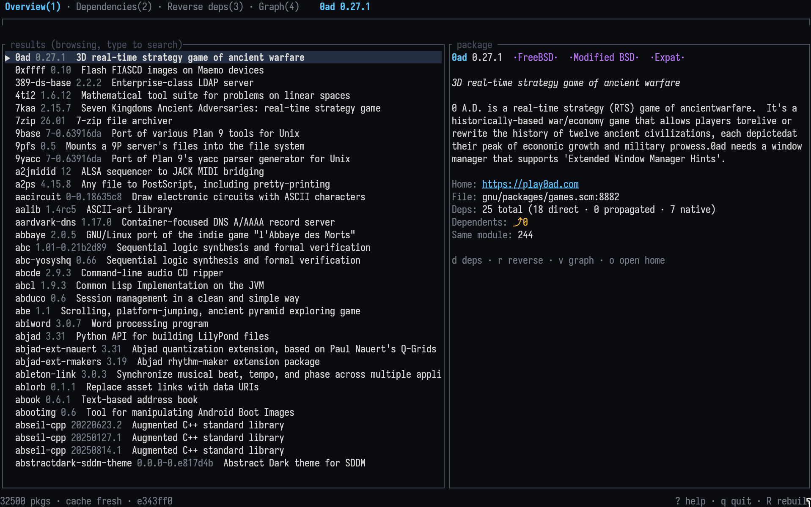
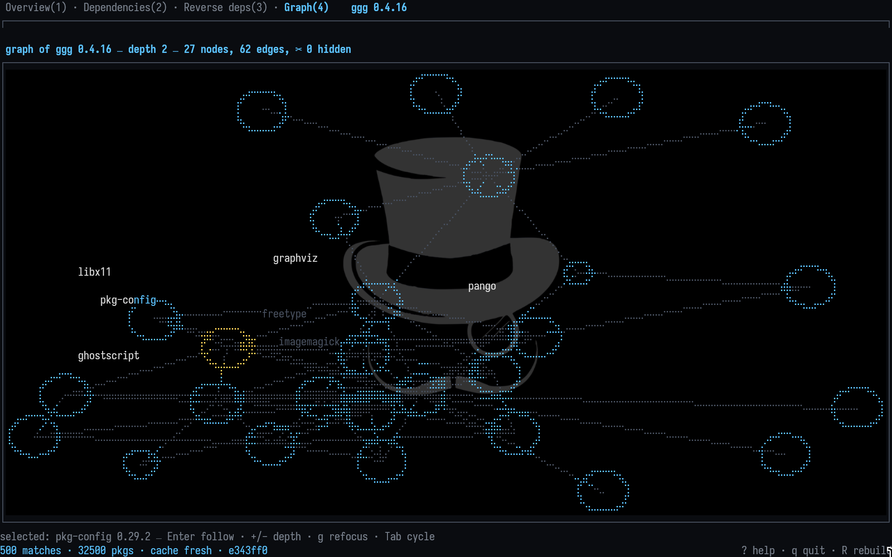
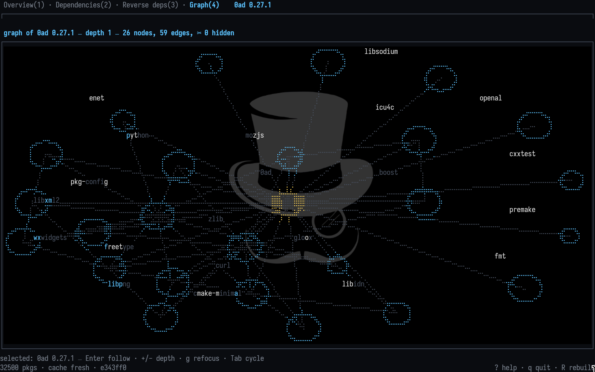
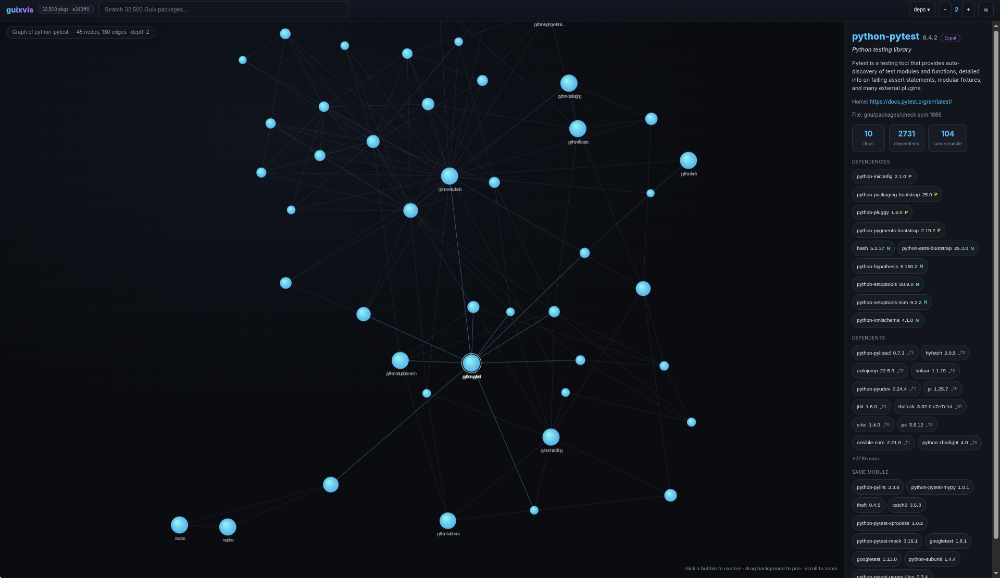
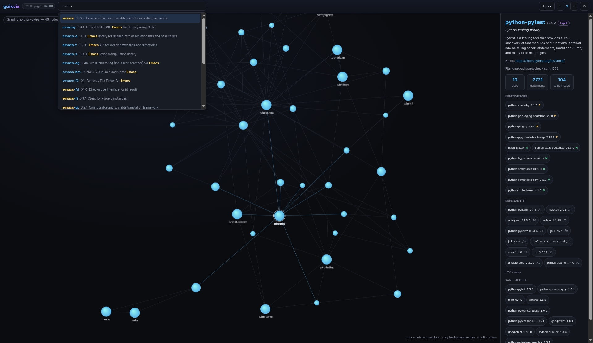
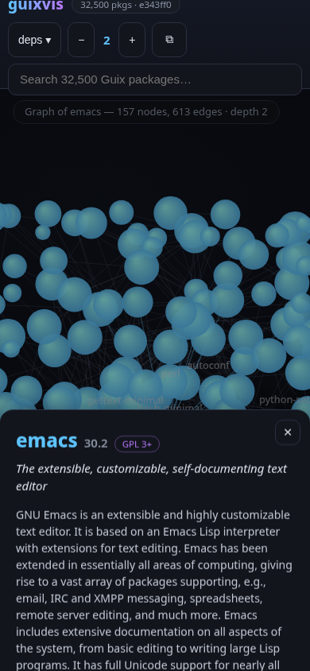
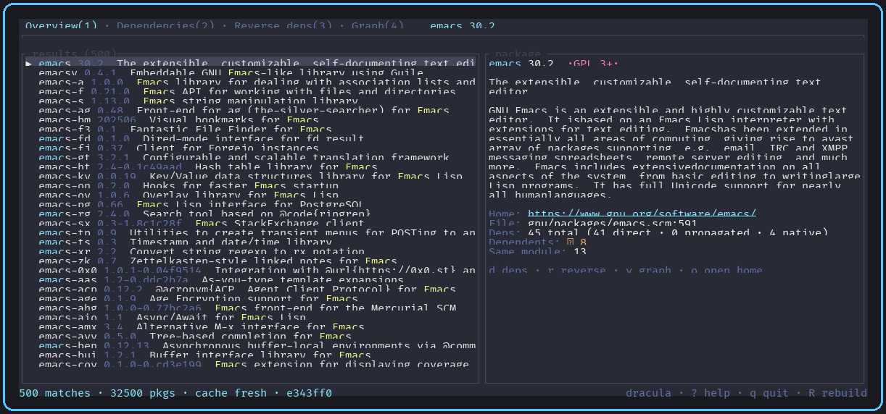
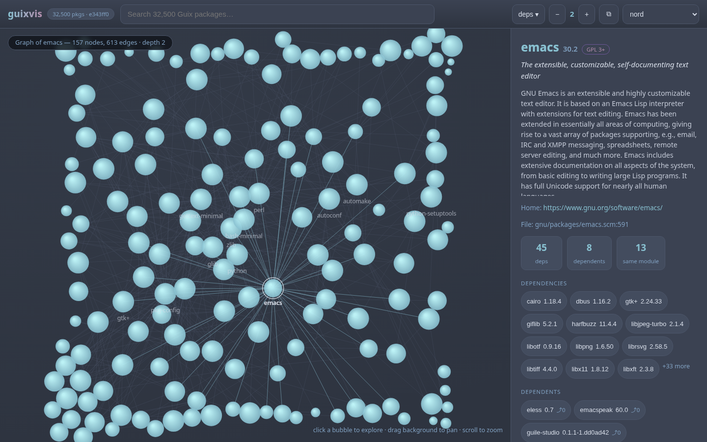
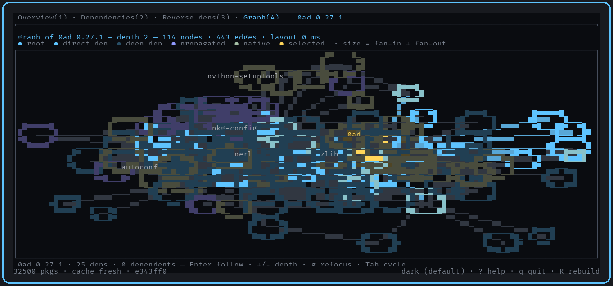

# guixvis

Explorador interativo de pacotes e visualizador de dependências para o
**GNU Guix** — uma interface de terminal (Rust + ratatui) no espírito do
pacvis do Arch: pesquise **qualquer** pacote, veja tudo que está
**relacionado** a ele, com busca fuzzy rápida e uma interface polida,
100% pelo teclado.

```
┌─ Busca: emac▌────────────────────────────────────────────────┐
│  [Visão geral(1)] [Dependências(2)] [Deps reversas(3)] [Grafo(4)] │
│ ┌───────────────────────────┐ ┌──────────────────────────────┐│
│ │ ▶ emacs  30.2  GPL 3+     │ │ GNU Emacs é um editor…        ││
│ │   emacs-minimal  30.2     │ │                              ││
│ │   emacs-next  31.0        │ │ Home: gnu.org/software/emacs  ││
│ │   (destaques do fuzzy)    │ │ Arq.: gnu/packages/emacs.scm:591│
│ └───────────────────────────┘ └──────────────────────────────┘│
│ 157 resultados · 32500 pacotes · cache atualizado (e343ff0)   │
└───────────────────────────────────────────────────────────────┘
```

## Uma nota do autor

Fiz isso para o meu próprio uso. Rodo Guix nas minhas máquinas, vivia esquecendo
como os pacotes se ligam, e queria algo mais rápido do que passar a tarde
grepeando `guix show` — por isso o guixvis é todo de teclado, escuro por padrão,
e o grafo foi feito para ser lido no terminal.

É a ferramenta que eu uso todo dia. Sinta-se à vontade para usar também, e para
mudar o que não te agradar.

## Recursos

- **Pesquise qualquer coisa** — busca fuzzy em todos os pacotes
  (nome + sinopse), com destaques e ~4 ms por tecla sobre o conjunto
  completo de 32.500 pacotes.
- **Detalhes do pacote** — versão, descrição, licenças, homepage e a
  localização do código-fonte (`gnu/packages/emacs.scm:591`).
- **Dependências** — árvore expansível de inputs (`P` propagado, `N` nativo),
  com contagem de dependentes em cada nó (`⤴ 12`).
- **Dependências reversas** — "quem depende deste pacote": lista direta e
  uma seção transitiva com limite de profundidade.
- **Grafo de dependências** — layout dirigido por forças (Fruchterman–
  Reingold determinístico), siga nós com Enter, profundidade com `+/−`.
- **Inicialização instantânea depois da primeira vez** — o índice fica em
  cache (JSON gzip) e é reconstruído automaticamente quando o commit do seu
  canal Guix muda.
- **Zero configuração** — funciona em qualquer sistema GNU Guix; a primeira
  execução constrói o índice em segundo plano com progresso ao vivo.

## Vídeo de demonstração

[](assets/guixvis-demo.mp4)

## Capturas de tela

Busca e detalhes do pacote:


Árvore de dependências (expanda/recolha com Enter):



Dependências reversas (quem depende deste pacote):



## Interface web

O `guixvis web` serve o mesmo explorador como um site local em
<http://127.0.0.1:8787>: busca fuzzy no topo, painel de detalhes com chips
clicáveis de pacotes relacionados e o grafo interativo em que cada bolha é
um pacote — clique em uma para abrir a visão dela. Links diretos
(`#/p/emacs?depth=2&dir=reverse`) são compartilháveis e funcionam com o
botão voltar do navegador; o layout é responsivo até em telas de celular.

▶ [Assista à demonstração da interface web](assets/guixvis-web-demo.mp4)







## Temas

As duas interfaces trazem oito temas de cores: **dark** (padrão), **one**,
**light**, **dracula**, **nord**, **gruvbox-dark**, **tokyo-night** e
**catppuccin-mocha**.

- TUI: pressione `T` para alternar (o tema ativo aparece na barra de
  status); `NO_COLOR` é respeitado com um tema em tons de cinza.
- Interface web: escolha o tema no seletor do topo; a escolha fica salva
  entre as sessões.

A TUI no tema dracula:



A interface web no tema nord:



## Requisitos

- GNU Guix (`guix` no `PATH`, ou defina `GUIX` apontando para o seu perfil).
- Rust 1.85+ (edition 2021) para compilar a partir do código-fonte.

## Instalação

```sh
git clone https://codeberg.org/berkeley/guixvis guixvis
cd guixvis
cargo install --path .            # instala em ~/.cargo/bin
# ou, para deixar direto no seu PATH:
cargo install --root ~/.local --path .
guixvis
```

Espelhos: `github.com/cristiancmoises/guixvis`,
`git.securityops.co/cristiancmoises/guixvis`,
`git.securityops.com.br/cristiancmoises/guixvis`.

### Pelo canal Guix da securityops

O guixvis está empacotado no
[canal securityops](https://git.securityops.com.br/cristiancmoises/securityops-channel)
(`(securityops packages apps)`). Adicione o canal ao `channels.scm` (veja o
README do canal), rode `guix pull` e então:

```sh
guix install guixvis
```

O canal compila o guixvis a partir do código-fonte com o registro Cargo
vendado (offline, `cargo --frozen`), incluindo a interface web
(`guixvis web`).

### Emacs

Tem um arquivo pequeno em `elisp/` para quem vive no Emacs. Aponte o
`load-path` para ele e você ganha `M-x guixvis` (roda a TUI num buffer
`term`) e `M-x guixvis-web`. Se você também usa o emacs-guix, uma chamada
coloca os dois no popup `guix`:

```elisp
(add-to-list 'load-path "/caminho/para/guixvis/elisp")
(require 'guixvis)
(guixvis-popup-install)
```

O arquivo fica aqui, e não no emacs-guix, para que as entradas do menu só
apareçam para quem realmente tem o programa instalado (veja
[guix/emacs-guix#40](https://codeberg.org/guix/emacs-guix/pulls/40)).

## Uso

```
guixvis              inicia o explorador (constrói o índice na 1ª execução)
guixvis --rebuild    força a reconstrução do índice
guixvis --help       todas as opções
```

### Teclas

| Tecla | Ação |
|---|---|
| digite | busca fuzzy (sempre ativa) |
| `Esc` | limpar busca / voltar |
| `Tab` / `Shift+Tab` | alternar abas |
| `1`–`4` | ir para a aba (Visão geral, Dependências, Deps reversas, Grafo) |
| `↑` `↓` (ou `j` `k` com busca vazia) | mover seleção |
| `PgUp` / `PgDn` | paginar |
| `Enter` | expandir/recolher nó da árvore · seguir nó do grafo |
| `d` / `r` / `v` (busca vazia) | abrir dependências / deps reversas / grafo |
| `h` / `l` ou `←` / `→` | recolher / expandir nó da árvore |
| `+` / `−` | profundidade do grafo (1–8) |
| `g` / `G` (busca vazia) | topo / fim (no grafo: refocar a raiz) |
| `o` (busca vazia) | abrir homepage no `$BROWSER`/`xdg-open` |
| `T` | alternar tema (8 paletas) |
| `R` | reconstruir o índice em segundo plano |
| `?` | ajuda |
| `q` (busca vazia) / `Ctrl+C` | sair |

As teclas de comando (`d`, `r`, `v`, `j`, `k`, `g`, `G`, `q`, `o`, `+`, `−`,
`1`–`4`) agem apenas com a busca vazia, para nunca roubar a digitação; use as
setas para navegar enquanto digita.

### Abas

1. **Visão geral** — lista de resultados + painel de detalhes.
2. **Dependências** — árvore expansível do que o pacote precisa.
3. **Deps reversas** — dependentes diretos (expansíveis) + seção transitiva
   (profundidade 2+; pressione Enter no cabeçalho da seção para abrir).
4. **Grafo** — grafo de dependências por forças; Enter segue um nó,
   `+`/`−` ajusta a profundidade, `g` refoca a raiz no pacote selecionado.

## Como funciona

Ao iniciar, o guixvis carrega o cache ou executa `guix repl` com um script
Guile embutido (`data/guix-index.scm`) que percorre todos os pacotes com
`fold-packages`, extrai nome/versão/sinopse/descrição/licenças/localização e
as arestas de dependência, e emite um único documento JSON na saída padrão
(progresso na saída de erro). O lado Rust valida o documento, resolve as
dependências, calcula as arestas reversas e mantém o índice em memória. Um
snapshot binário desse índice resolvido é gravado em:

```
~/.cache/guixvis/index-v4.bin
```

O snapshot existe porque reparsear o JSON do indexador a cada partida custava
mais do que todo o resto do programa somado; os números estão na seção de
desempenho. Ele é escrito num arquivo temporário e renomeado no lugar, então
uma queda no meio da escrita não deixa cache pela metade.

O cache é vinculado ao commit do seu canal Guix (via `guix describe`);
quando o Guix é atualizado, o cache é reconstruído sozinho. Um cache
corrompido é posto em quarentena (renomeado, nunca apagado em silêncio).

## Lendo o grafo

O grafo era um campo de pontinhos iguais — um grafo de verdade, mas inútil como
imagem. Agora ele mostra o que interessa:



- **Tamanho** é fan-in mais fan-out: os hubs saltam aos olhos.
- **Cor** segue a profundidade do BFS: raiz clara, dependências diretas normais,
  e quanto mais fundo, mais apagado.
- **Matiz** indica o tipo de aresta que trouxe o pacote: propagated puxa para o
  roxo, native para o âmbar, inputs comuns ficam azuis.
- **Seleção** ganha um halo, os vizinhos clareiam e o resto escurece — ajuda em
  aglomerado denso.
- **Rótulos** aparecem para a seleção, a raiz e os maiores hubs que couberem na
  largura do terminal.
- O cabeçalho mostra nós, arestas, nós ocultos e o tempo do layout; o rodapé
  mostra o pacote selecionado com as contagens de dependências.

Teclas: `Enter` segue o nó selecionado, `+`/`−` mudam a profundidade, `g`
refocaliza a raiz, `1`–`4` (ou `Tab`) trocam de aba, `T` alterna os temas.

## Desempenho

Partida, busca e layout são medidos, não estimados. `cargo run --release
--example bench` imprime os mesmos números na sua máquina:

| Etapa | Tempo | Observação |
|---|---|---|
| Construção do índice (`guix repl` + Guile) | **3,7 s** | só quando o cache falta ou o canal mudou |
| Cache até índice utilizável | **30 ms** | snapshot binário, 32.500 pacotes (era ~126 ms com JSON gzipado) |
| Busca fuzzy, 500 resultados | **~2 ms** | matcher nucleo sobre nome + sinopse |
| Layout do grafo, 200 nós | **≤10 ms** | Fruchterman–Reingold determinístico, 300 iterações |

O indexador já é rápido o bastante para que paralelizá-lo rendesse pouco; o
tempo estava no formato do cache, então foi ali que ele foi gasto. O snapshot
fica em `~/.cache/guixvis/index-v4.bin`, é escrito de forma atômica e é atrelado
ao commit do seu Guix.

## Segurança

O guixvis roda na sua máquina e lê a sua instalação do Guix, então a interface
web é deliberadamente chata quanto a alcance:

- escuta apenas em `127.0.0.1` e recusa conexões cujo par não é loopback;
- recusa requisições cujo `Host` não seja `localhost`/`127.0.0.1`/`::1`
  (proteção contra DNS rebinding) e cujo `Origin` ou `Sec-Fetch-Site` indique
  outro site;
- serve CSP estrita (`default-src 'self'`), `X-Content-Type-Options`,
  `X-Frame-Options: DENY`, `Referrer-Policy: no-referrer`,
  `Cross-Origin-Resource-Policy` e `Cache-Control: no-store` na API;
- valida os nomes de pacote vindos da URL, limita a busca a 200 caracteres, a
  profundidade a 1–8 e o grafo a 200 nós, com concorrência máxima de quatro;
- grava o script Guile embutido num diretório privado `0700` como arquivo `0600`
  (o diretório temporário do sistema é gravável por todos) e recusa arquivos de
  cache absurdamente grandes antes de lê-los.

Não há autenticação porque não há o que autenticar: a API é somente leitura,
apenas em loopback, e não altera nada.

## Desenvolvimento

```sh
cargo fmt --check
cargo clippy --all-targets -- -D warnings
cargo test                                   # testes unitários e de fixture
cargo test --test live_guix_tests -- --ignored   # testes reais contra o Guix
```

Estrutura: `src/index.rs` (índice em memória + BFS), `src/search.rs` (busca
fuzzy com nucleo), `src/indexer.rs` (subprocesso `guix repl`),
`src/cache.rs` (cache gzip), `src/graph.rs` (extração do grafo + layout),
`src/app.rs` (estado + teclas), `src/ui/*` (renderização),
`data/guix-index.scm` (indexador Guile).

## Solução de problemas

- **"guix not found"** — exporte `GUIX=/caminho/do/seu-perfil` ou instale o
  Guix; o guixvis também procura nos caminhos padrão de perfil do sistema.
- **Primeira execução lenta** — a primeira construção compila os módulos
  Guile de pacotes; leva segundos com cache quente e alguns minutos frio.
  O progresso aparece ao vivo.
- **Dados desatualizados após `guix pull`** — reinicie o guixvis; o cache é
  reconstruído automaticamente porque o commit do canal mudou.
- **Sem cores** — `NO_COLOR` é respeitado (tema em tons de cinza).
- **Indexador travado** — pressione `R` para recomeçar, ou apague
  `~/.cache/guixvis/` e reinicie.

## Licença

GPL-3.0-or-later. Veja [LICENSE](LICENSE).
